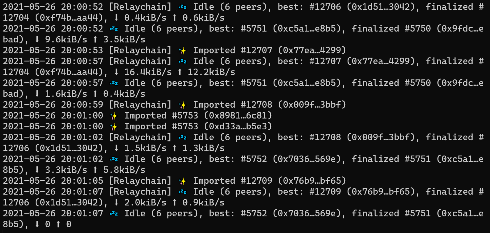

# Account Management

### Introduction <a href="#introduction" id="introduction"></a>

When running a collator node on InvArch/Tinker networks, there are some account management activities that you will need to be aware of. First and foremost you will need to create session keys for your primary and backup servers which will be used to sign blocks.

In addition, there are some optional account management activities that you can consider such as setting an on-chain identity or setting up proxy accounts.

This guide will cover how to manage your collator account including generating and rotating your session keys, setting an identity, and creating proxy accounts.

### Session Keys <a href="#session-keys" id="session-keys"></a>

Collators will need to sign blocks using an author ID, which is basically a [session key](https://wiki.polkadot.network/docs/learn-keys#session-keys). To match the Substrate standard, Moonbeam collator's session keys are [SR25519](https://wiki.polkadot.network/docs/learn-keys#what-is-sr25519-and-where-did-it-come-from). This guide will show you how you can create/rotate your session keys associated with your collator node.

First, make sure you're **running a collator node**. Once you have your collator node running, your terminal should print similar logs:



Next, session keys can be created/rotated by sending an RPC call to the HTTP endpoint with the `author_rotateKeys` method. For reference, if your collator's HTTP endpoint is at port `9933`, the JSON-RPC call might look like this:

```
curl http://127.0.0.1:9933 -H \
"Content-Type:application/json;charset=utf-8" -d \
  '{
    "jsonrpc":"2.0",
    "id":1,
    "method":"author_rotateKeys",
    "params": []
  }'
```

The collator node should respond with the corresponding public key of the new author ID (session key).

```
~$ curl http://127.0.0.1:9933 -H \
> "Content-Type:application/json;charset=utf-8" -d \
>   '{
>    "jsonrpc":"2.0",
>    "id":1,
>    "method":"author_rotateKeys",
>    "params":[]
>   }'
{"jsonrpc":"2.0", "result":"<your session key>", "id":1}
```

Make sure you write down the public key of the session key. Each of your servers, your primary and backup, should have their own unique key. Since the keys never leave your servers, you can consider them a unique ID for that server.

### Setting an Identity <a href="#setting-an-identity" id="setting-an-identity"></a>

Setting an on-chain identity enables your collator node to be easily identifiable. As opposed to showing your account address, your chosen display name will be displayed instead.

There are a couple of ways you can set your identity, to learn how to set an identity for your collator node please check out the **Managing your Account Identity** page of our documentation.

### Proxy Accounts <a href="#proxy-accounts" id="proxy-accounts"></a>

Proxy accounts are accounts that can be enabled to perform a limited number of actions on your behalf. Proxies allow users to keep a primary account securely in cold storage while using the proxy to actively participate in the network on behalf of the primary account. You can remove authorization of the proxy account at any time. As an additional layer of security, you can setup your proxy with a delay period. This delay period would provide you time to review the transaction, and cancel if needed, before it automatically gets executed.

To learn how to setup a proxy account, please refer to the **Setting up a Proxy Account** page of our documentation.
