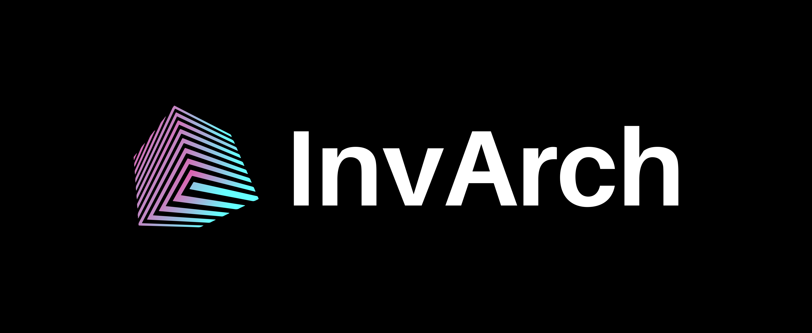

# Welcome to InvArch

Welcome to the documentation for the InvArch. Here, you'll find both high-level and technical information for developers, collators, end-users, and other InvArch network participants.

This site will grow and be refined over time as InvArch is developed. We welcome you to join the InvArch community and contribute to this site and to the project.

***

## What is InvArch?

InvArch is an A Git Compatible IP Hosting, Management, & Cross-Chain Authentication Network for Web3. It is a future Polkadot parachain that will allow users to tokenize their ideas and developers to build new and exciting applications that utilize this database and also cross-chain authentication.

InvArch will also be a parachain on the Polkadot network. That means it will get shared security from the Polkadot relay chain and will be able to integrate with other chains that are connected to Polkadot.

## Get Involved

### Learn

Get started by learn how InvArch works [here](./#learn).

### Maintain

If you want to contribute to maintain the network or becoming a node operators, you may find the documentations [here](02-node-operators/).

### Build

Most up-to-date information on the status of the development tools / kits (SDK) can be found [here](./#build).

## How to Engage With the InvArch Community

### Discord

Instructions for our TestNet and other development-focused conversation is found on our [Discord channel](https://discord.com/invite/UDuyBC2EC7).

### Telegram

General information and other non-technical topics can be discussed in our Telegram group [here](https://t.me/InvArch).

### Twitter

Follow us on Twitter for regular updates: [@InvArchNetwork](https://twitter.com/InvArchNetwork).

### SubSocial

Read our news and updates on SubSocial Network [here](https://app.subsocial.network/5857).

### Medium

Our archived news on Medium [here](https://invarch.medium.com/).

### Reddit

Join our discussion on subreddit of InvArch [here](https://www.reddit.com/r/InvArchNetwork/).

### YouTube

For video-tutorials and related content, subscribe to our YouTube channel [here](https://www.youtube.com/channel/UCSUD4kuRxXfOuRkVL0hpxXg).

## InvArch Ambassador Program

Join a global community of over 10,000 supporters and counting [here](https://invarch.network/community.html).
