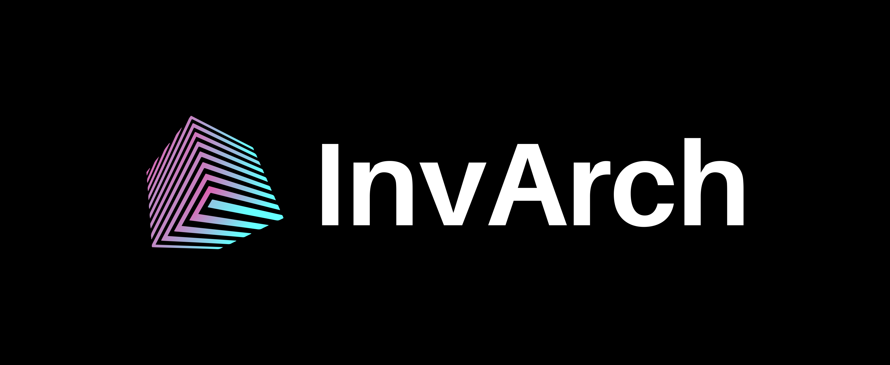

# InvArch Documentation and Resources

## Welcome to InvArch
Hello, and welcome to the beginning of your exciting journey here at InvArch! This is the start of an amazing new chapter in your life where you will contribute to one of the most ambitious blockchain projects in the world.

## Getting Started
- If you want to quickly find some general information, such as communities and white papers, please find [Learn](/learn/) section. 
- If you're interested in operating a node, head on over to the [Node Operators](/node-operators/) section. 
- If you're eager to start building your project to connect to InvArch, see the [Builders](/builders/) section. 